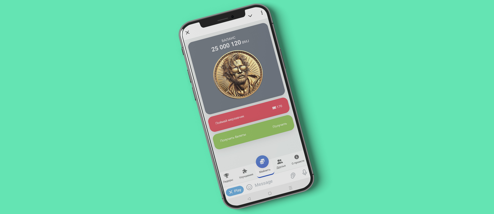

# Crypto Clicker Game - Telegram Miniapp

BOMJ COIN is a Telegram bot developed as a demonstration of the capabilities of the TON blockchain. The project was created by [low digital](https://t.me/low_digital) and quickly gained popularity due to its engaging gameplay and virtual coin earning opportunities.

## Demo

You can check out the game right now on Telegram: https://t.me/bmjcoinbot

## Description

BOMJ COIN is an interactive game where users can earn virtual coins, enhance their skills, and compete with other players. The bot offers several game modes, including mini-games and an upgrade system.

## Installation and Setup

### Prerequisites

- PHP 7.4 or higher
- MySQL 5.7 or higher
- Telegram Bot API Token

### Installation Steps

1. **Clone the repository:**

   ```bash
   git clone https://github.com/lowdigital/crypto-clicker-miniapp.git
   cd crypto-clicker-miniapp
   ```

2. **Set up the database:**

   - Create a MySQL database

3. **Configure the connection:**

   - Open the `_dbconnect.php` file and enter your database connection details:

     ```php
     <?php
     $tg_token = "YOUR_TELEGRAM_BOT_TOKEN";

     $dbhost = 'localhost';
     $dbuser = 'YOUR_DB_USER';
     $dbpassword = 'YOUR_DB_PASSWORD';
     $dbname = 'YOUR_DB_NAME';

     $link = mysqli_connect($dbhost, $dbuser, $dbpassword, $dbname);
     if (!$link) exit;
     mysqli_query($link, "SET NAMES 'utf8mb4'");
     ?>
     ```

4. **Set up the Telegram webhook:**

   - Set the webhook for your bot:

     ```bash
     curl -F "url=https://yourdomain.com/path/to/webhook.php" https://api.telegram.org/botYOUR_TELEGRAM_BOT_TOKEN/setWebhook
     ```

5. **Deploy the project:**

   - Deploy the project on your web server.
   - Ensure your web server is configured to handle PHP scripts and is accessible from the internet to receive webhooks from Telegram.

6. **UI KIT Setup:**

   - Purchase and download the UI KIT from [AppKit Mobile UI KIT](https://themeforest.net/item/appkit-mobile/27679559).
   - Extract all directories from the "code" folder in the UI KIT archive into the "core" directory of your project.

7. **Set Up CRON Jobs:**

   To ensure the application runs smoothly and its background tasks are executed timely, you need to set up the following CRON jobs:

   - **Autopilot Script** (`/cron/autopilot.php`):
     - **Frequency**: Every hour
     - **CRON Expression**:
       ```bash
       0 * * * * /usr/bin/php /path/to/your/project/cron/autopilot.php
       ```

   - **Avatar Update Script** (`/cron/avatar.php`):
     - **Frequency**: Every minute
     - **CRON Expression**:
       ```bash
       * * * * * /usr/bin/php /path/to/your/project/cron/avatar.php
       ```

   - **Daily Script** (`/cron/index.php`):
     - **Frequency**: At midnight every day
     - **CRON Expression**:
       ```bash
       0 0 * * * /usr/bin/php /path/to/your/project/cron/index.php
       ```

   **Steps to Set Up CRON Jobs:**

   1. Open your CRON job configuration file:
      ```bash
      crontab -e
      ```

   2. Add the above CRON expressions to the file, replacing `/path/to/your/project` with the actual path to your project directory.

   3. Save and exit the editor.

   These CRON jobs will now execute the specified scripts at their respective intervals.

## Usage

Start interacting with the bot by sending the `/start` command in Telegram.

Enjoy managing your BOMJ COIN and climbing the leaderboards!

## Main Files and Directories

- `webhook.php` — Main file for handling incoming messages from Telegram.
- `_dbconnect.php` — Database connection file.
- `_boosters.php` — File containing information about available boosters.
- `app.js` — Main JavaScript file for the frontend.
- `api/` — Directory with API endpoints for various bot actions.

## License

This project is licensed under the MIT License.

## Author

Follow updates on my Telegram channel: [low digital](https://t.me/low_digital).
